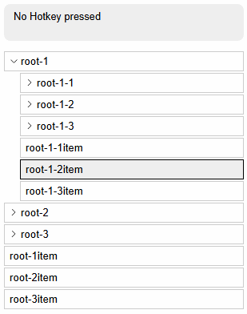
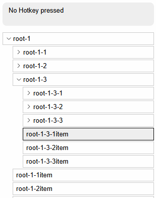
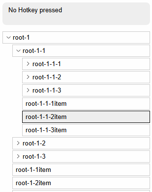
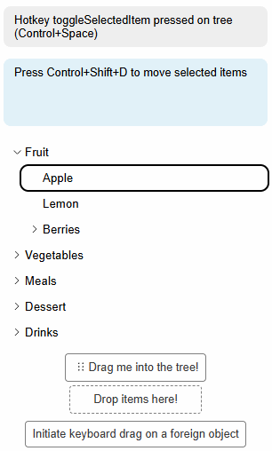

## Accessibility according to W3 Specs

Headless Tree follows accessibility guidelines defined by W3 in the [Navigation Treeview Pattern](https://www.w3.org/WAI/ARIA/apg/patterns/treeview/examples/treeview-navigation/#support-notice-header),
specificially, the [Treeview with declared properties](https://www.w3.org/WAI/ARIA/apg/patterns/treeview/examples/treeview-1b/).

All relevant aria attributes are provided to the tree and its items automatically.

## Hotkeys

Headless Tree comes with various hotkeys that make using it easier when relying on keyboard
interactions. Hotkeys are enabled if the [Hotkeys Feature](/features/hotkeys) is included in the tree configuration,
and can be configured as described in the [Hotkeys Guide](/guides/hotkeys).

The hotkeys are based on the [W3C recommendations on accessible trees](https://www.w3.org/WAI/ARIA/apg/patterns/treeview/examples/treeview-navigation/#support-notice-header),
and can be customized to fit your needs.

- Pressing `Shift` while using the arrow keys will extend the selection to the next item in the direction of the arrow key.

- Pressing `Ctrl` + `Space` will toggle the selection of the currently focused item. Pressing `Ctrl` + `A` will select all items in the tree.

- Pressing `Left` will collapse the currently focused item if it is open, or move the focus to the parent item if it is closed.
  Pressing `Right` will expand the currently focused item if it is closed, or move the focus to the first child item if it is open.

- Pressing `F2` will start renaming the currently focused item. Pressing `Escape` will cancel the renaming process, and pressing `Enter` will confirm the renaming.

- Entering any text while focusing an item will open the search input, and pressing `Escape` will close it. The search input
  acts as typeahead feature. The Up and Down keys are overwritten to navigate through the search results in this case.

- Pressing the `Home` or `End` button will move the focus to the first or last item in the tree, respectively.

## Keyboard-controlled Drag and Drop

To support moving items via drag-and-drop while staying compliant with accessibility standards, Headless Tree
supports keyboard-controlled drag-and-drop via the [Keyboard Drag and Drop Feature](/features/kdnd).

