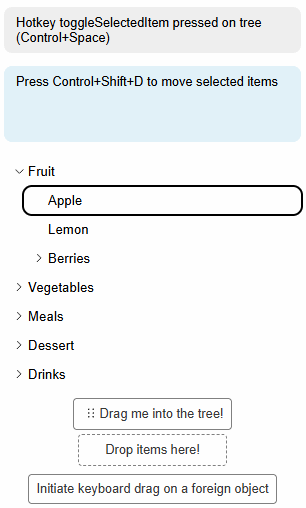

import { DemoBox } from "../../src/components/demo/demo-box";
import {FeaturePageHeader} from "../../src/components/docs-page/feature-page-header";

<FeaturePageHeader
    title="Keyboard Drag and Drop"
    subtitle="Keyboard-controlled Drag and Drop for assistive technologies"
    feature="keyboard-drag-and-drop"
/>

The Keyboard Drag and Drop feature provides a way to use the drag-and-drop functionality of the tree using only the keyboard.
This allows you to implement drag-based functionality while staying compliant with accessibility standards, by providing
the default drag capability with keyboard-controlled hotkeys and a visually hidden assistive text indicating the drag-process
to screen readers.



<DemoBox tags={["feature/dnd"]} initialStory="react-drag-and-drop-visible-assistive-text--visible-assistive-text" height="700px" />

## Setup

The Keyboard Drag and Drop feature mostly builds upon the normal [Drag and Drop](/features/dnd) feature, integrating
it mostly just means to add it as feature to the tree configuration and it will provide the necessary functionality
for keyboard-controlled drag-and-drop.

Note that this feature needs both the `dragAndDropFeature` and the `hotkeysCoreFeature` to work properly.

```
features: [
  syncDataLoaderFeature,
  selectionFeature,
  hotkeysCoreFeature,
  dragAndDropFeature,
  keyboardDragAndDropFeature,
],
```

One important aspect of the Keyboard Drag and Drop feature is the assistive text, which is used to inform screen readers
about the drag-and-drop process.

The [`@headless-tree/react`](/api/react) package exposes a [AssistiveTreeDescription](/api/react/function/AssistiveTreeDescription)
react component, that will automatically render the english assistive text for you in a visually hidden way. It
is recommended to put this component inside the tree root container, or otherwise reference it with aria-tags
in the tree.

```jsx
<div {...tree.getContainerProps()} className="tree">
  <AssistiveTreeDescription tree={tree} />
  {/* ...tree items... */}
</div>
````

Alternatively, you can build this text yourself by using the data available in the tree state that you can retrieve
with `tree.getState()`. You can use [treeState.assistiveDndState](/api/core/interface/TreeState#assistiveDndState)
of type [AssistiveDndState](/api/core/enum/AssistiveDndState) to determine in which state the drag-and-drop process is,
and [treeState.dnd](/api/core/interface/TreeState#dnd) for details about what is being dragged and where the user
is dropping it.

```ts
enum AssistiveDndState {
  None,
  Started,
  Dragging,
  Completed,
  Aborted,
}
```

## Dragging items out of the tree with keyboard

Selecting items inside the tree, and then dragging them out of the tree into a third-party component
is a core-functionality of the normal DnD Feature. You can find out more about that in the
[Guide on dragging in and out of trees](/dnd/foreign-dnd#dragging-tree-items-out-of-tree).

Since there is no actual drag-event happening in keyboard-bound situations, you need to implement
custom logic to accept a keyboard-controlled drag initiated in a Headless Tree instance.

You can detect whether the user is dragging items via keyboard by inspecting `tree.getState().assistiveDndState`,
if it is either `AssistiveDndState.Started` or `AssistiveDndState.Dragging`. In the logic that accepts such
a drag, you can get information about the items that are being dragged by inspecting `tree.getState().dnd?.draggedItems`.
You can then handle the dragged items (e.g. by removing them from the tree with [`removeItemsFromParents()`](/api/core/function/removeItemsFromParents))
and complete the keyboard drag with `tree.stopKeyboardDrag()`.

```jsx
<button
    onClick={async () => {
        const draggedItems = tree.getState().dnd.draggedItems;
        if (draggedItems) {
            await onCompleteForeignDrop(draggedItems);
            alert(draggedItems.map((item) => item.getItemName()));
        }
        tree.stopKeyboardDrag();
    }}
>
    Accept dragged items from tree
</button>
```


## Dragging foreign objects inside the tree with keyboard

Similarly, moving data from outside the tree into it via a drag event
is also a core-functionality of the normal DnD Feature. You can find out more about that in the
[Guide on dragging in and out of trees](/dnd/foreign-dnd#dragging-foreign-objects-inside-of-tree).

Again, this functionality works mostly out-of-the-box with headless tree, but the initiation of a keyboard-bound
drag event that can be accepted by Headless Tree needs to be done externally. If the user triggers something
that you consider a keyboard-bound drag event within the boundaries of your application, you can inform Headless
Tree that this is happening by calling `tree.startKeyboardDragOnForeignObject(dataTransfer);` with a custom
`dataTranfer` object, that you handle the same way as with normal foreign drag events. You can create this object
manually.

```jsx

<button
  onClick={() => {
    const dataTransfer = new DataTransfer();
    dataTransfer.setData("text/plain", "hello world");
    tree.startKeyboardDragOnForeignObject(dataTransfer);
  }}
>
  Initiate keyboard drag on a foreign object
</button>
```

