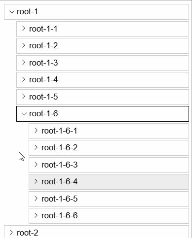

## Reparenting

For items dragged on the lower half of the bottom-most item of a tree, the specific
target folder is chosen based on horizontal offset of the dragged item. This is called
"Reparenting".

<!-- ## Dragging items on themselves -->
<!-- TODO document more special cases here -->