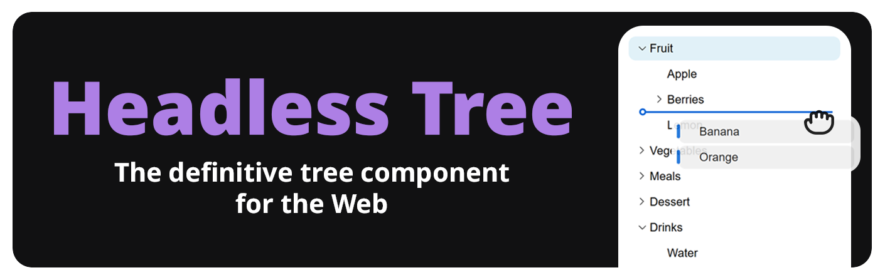

Super-easy integration of complex tree components into React. Supports ordered 
and unordered drag-and-drop, extensive keybindings, search, renaming and more.
Fully customizable and accessible. Headless Tree is the official successor for
[react-complex-tree](https://github.com/lukasbach/react-complex-tree).

It aims to bring the many features of complex tree views, like multi-select,
drag-and-drop, keyboard navigation, tree search, renaming and more, while
being unopinionated about the styling and rendering of the tree itself.
Accessibility is ensured by default, and the integration is extremely
simple and flexible. 

The interface gives you a flat list of tree nodes
that you can easily render yourself, which keeps the complexity of the
code low and allows you to customize the tree to your needs. This flat
structure also allows you to virtualize the tree with any virtualization
library you want. The library automatically provides the necessary
aria tags to emulate a nested tree structure, so that accessibility
requirements are met despite the flat structure.

Dive into [the Get Started page](https://headless-tree.lukasbach.com/getstarted)
to find out how to use Headless Tree, or have a look at
[the samples on the Headless Tree Homepage](https://headless-tree.lukasbach.com/#demogrid)
to get an idea of what you can do with it.

> [!TIP]  
> Headless Tree is now available as Beta! The library is mostly stable and
> production ready, and will be generally released within two months, once
> I have collected feedback and fixed any bugs that might arise. Join
> [the Discord](https://discord.gg/KuZ6EezzVw) to get involved, and
> [follow on Bluesky](https://bsky.app/profile/lukasbach.bsky.social) to
> stay up to date.

## Bundle Size

Headless Tree exports individual features in a tree-shaking-friendly
way, allowing you to only include what you need to keep your bundle size
small. Listed bundle sizes are based on min+gzipped bundles, and are
based on the Bundlephobia report as of Headless Tree v0.0.15.

| Feature                | Bundle Size |
|------------------------|-------------|
| Tree Core              | 3.1kB       |
| Sync Data Loader       | 0.8kB       |
| Async Data Loader      | 1.4kB       |
| Selections             | 1.1kB       |
| Drag and Drop          | 2.8kB       |
| Keyboard Drag and Drop | 2.7kB       |
| Hotkeys                | 0.8kB       |
| Tree Search            | 1.3kB       |
| Renaming               | 0.9kB       |
| Expand All             | 0.7kB       |
| React Bindings         | 0.4kB       |

Total bundle size is 9.5kB plus 0.4kB for the React bindings. Note that
the sum of features is bigger than the total bundle size, because several
features share code. Tree-shaking will ensure that the minimum amount of
code is included in your bundle.
